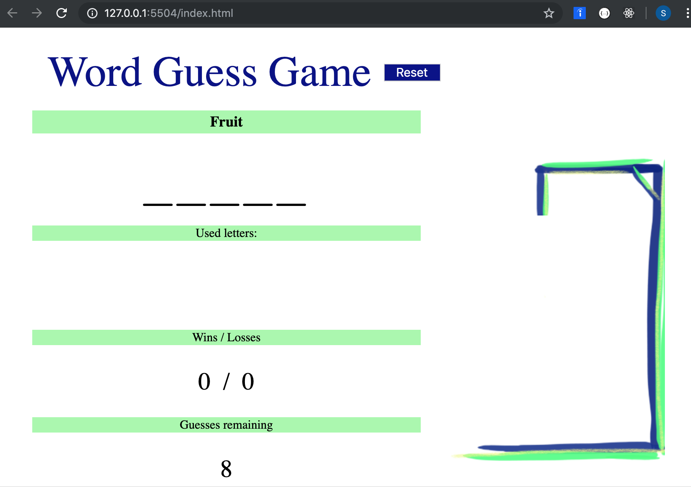

### Prerequisites
There is no prerequisites for this game. It is deployed as a githug web site.

### Installation
There are no installation steps.

### Testing
I do not have any automated unit tests. I did manual testing.
I came up with several test cases I tested manualy.
I used web browser's development tools to debug javascript execution.

### Deployment
I pushed all git changes to github and configured web site pointing to the root of the repository.

### Version
I guess it is version 1.0.0.

### Tools, Technologies, Languages
I have built this game with plain html, css and javascript. I have used VS Code.

